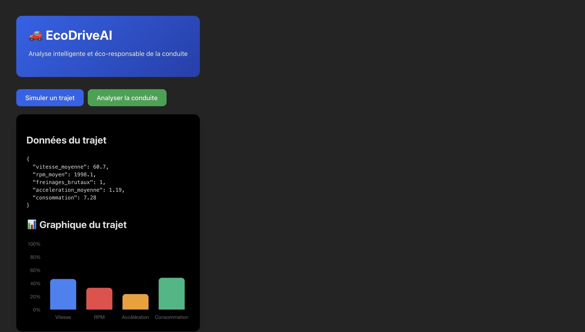
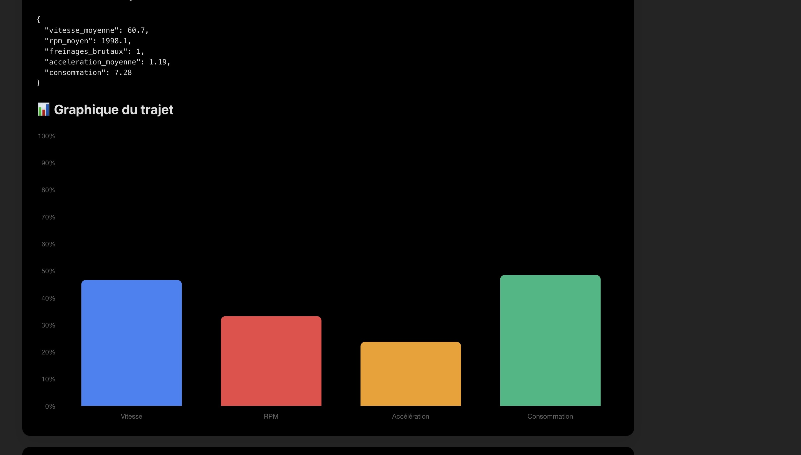

# 🚗 EcoDriveAI – AI-Powered Eco-Driving Analysis Platform

<p align="center">


</p>

---

# 📌 Overview

EcoDriveAI is an AI-powered web application that analyzes driving behavior and generates personalized eco-driving recommendations.

The platform combines:

- 🚘 Trip simulation
- 📊 Driving performance visualization
- 🤖 Machine Learning analysis
- 🧠 AI-generated driving reports using Ollama (Phi-3)
- 💾 MongoDB trip history storage

The objective is to help drivers improve fuel efficiency, reduce aggressive driving behavior, and encourage more sustainable driving habits.

---

# ✨ Key Features

✅ Interactive trip simulation

✅ Driving behavior analysis

✅ Eco-score calculation

✅ Risk assessment

✅ Personalized driving recommendations

✅ AI-generated driving report

✅ Interactive charts

✅ MongoDB storage

✅ Modern React interface

---

# 🖥️ Application Preview

## 🏠 Home


---

## 🚗 Trip Simulation

The application generates realistic driving data including:

- Average speed
- Engine RPM
- Sudden braking
- Average acceleration
- Fuel consumption



---

## 📊 Driving Performance Dashboard

Driving metrics are displayed through interactive charts for quick interpretation.



---

## 🤖 AI Driving Analysis

The backend evaluates the trip and returns:

- Driving Style
- Eco Score
- Risk Level
- Personalized Advice


---

## 🧠 AI Generated Report

Using Ollama (Phi-3), the application automatically generates a detailed driving report explaining the driver's behavior and suggesting improvements.


---

# 🏗️ System Architecture

```
                React Frontend
                       │
                       │ HTTP
                       ▼
                FastAPI Backend
                       │
      ┌────────────────┼─────────────────┐
      │                │                 │
      ▼                ▼                 ▼
Driving Analysis   Ollama Phi-3      MongoDB
 Logic             AI Report        Trip Storage
```

---

# ⚙️ Tech Stack

## Frontend

- React
- Axios
- CSS
- Recharts

## Backend

- FastAPI
- Python
- Pydantic

## Artificial Intelligence

- Ollama
- Phi-3 LLM

## Database

- MongoDB

---

# 📈 Workflow

```
Generate Trip
      │
      ▼
Display Driving Metrics
      │
      ▼
Send Data to FastAPI
      │
      ▼
Driving Analysis
      │
      ▼
Generate AI Report (Phi-3)
      │
      ▼
Store Trip in MongoDB
      │
      ▼
Display Results
```

---

# 📊 Returned Analysis

Each analysis includes:

| Metric | Description |
|----------|-------------|
| Driving Style | Overall driving behavior |
| Eco Score | Environmental performance score |
| Risk Level | Mechanical driving risk |
| Advice | Personalized recommendations |
| AI Report | Detailed driving analysis |

---

# 🚀 Installation

## Clone repository

```bash
git clone https://github.com/salma-abarkane/ECODRIVEAI.git
```

---

## Backend

```bash
cd backend

python -m venv venv

source venv/bin/activate      # macOS/Linux

venv\Scripts\activate         # Windows

pip install -r requirements.txt

uvicorn backend.main:app --reload
```

Backend runs on

```
http://127.0.0.1:8000
```

---

## Frontend

```bash
npm install

npm run dev
```

Frontend runs on

```
http://localhost:5173
```

---

# 📂 Project Structure

```
ECODRIVEAI
│
├── assets/
│   ├── home.png
│   ├── simulation.png
│   ├── trip-chart.png
│   ├── ai-analysis.png
│   └── ai-report.png
│
├── backend/
│
├── src/
│
├── package.json
│
├── requirements.txt
│
└── README.md
```

---

# 🔮 Future Improvements

- User authentication

- Driving history dashboard

- GPS integration

- Real vehicle telemetry

- Mobile application

- Advanced Machine Learning model

- CO₂ emission estimation

- Multi-language support

---

# 👨‍💻 Author

**Salma Abarkane**

AI & Machine Learning Engineer

- LinkedIn: https://www.linkedin.com/in/salma-abarkane/
- GitHub: https://github.com/salma-abarkane

---

# 📄 License

This project is released under the MIT License.

---

# ⭐ Project Highlights

- Full Stack AI Application
- FastAPI REST API
- React Frontend
- MongoDB Integration
- Ollama (Phi-3) Integration
- Interactive Data Visualization
- AI-generated Reports
- Modern User Interface
- Clean Project Architecture

---

If you found this project interesting, don't forget to ⭐ the repository.
